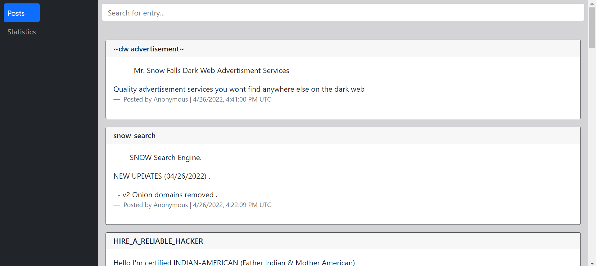

# Dark net scraper

The [dark net](https://en.wikipedia.org/wiki/Darknet 'Darknet') holds many criminal business and illegal markets. One such site is The Stronghold Paste Site. This project scrapes the site, displaying insight on the posted pastes.

## Technologies

-   JavaScript
-   MongoDB
-   React
-   Docker
-   Bootstrap
-   Express.js
-   Tor Proxy

## Requirements

-   [Docker](https://docs.docker.com/desktop/)
-   [Docker Compose](https://docs.docker.com/compose/install/)

## Usage

1. Clone this repo
2. Add .env file to backend directory with mongoDB URI:  
   `DB=<MongoDB_URI>`
3. Run  
   `docker compose up --build`

## Site

The site features 2 main pages:

1. Posts  
     
   Displays recently fetched pastes, with category labels on some pastes. The search bar at the top can be used to search all saved pastes by a query.

2. Stats  
     
   Displays category statistics of all saved pastes.  
   Chart created using chart.js.
